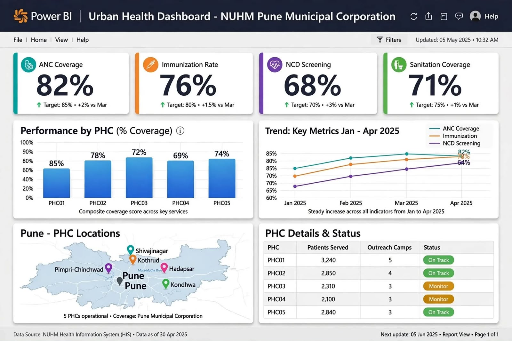

# Urban Health Intelligence Dashboard - NUHM Pune

## Overview
AI-augmented NUHM monitoring for Pune Municipal Corporation - tracking 12 KPIs across 15+ PHCs serving 500K+ population. Automated ETL pipeline reducing manual reporting by 40%.

## Features
- Power BI dashboard with ANC, Immunization, NCD, Sanitation coverage
- Forecasting with Prophet to predict KPI drops
- LLM auto-generated policy briefs

## Stack
Power BI | Python | SQL | Prophet | Llama 3.2 | Streamlit

## Live Demo
https://preet01-bit.github.io/urban-health-intelligence-dashboard/

Data: NUHM Health Information System
